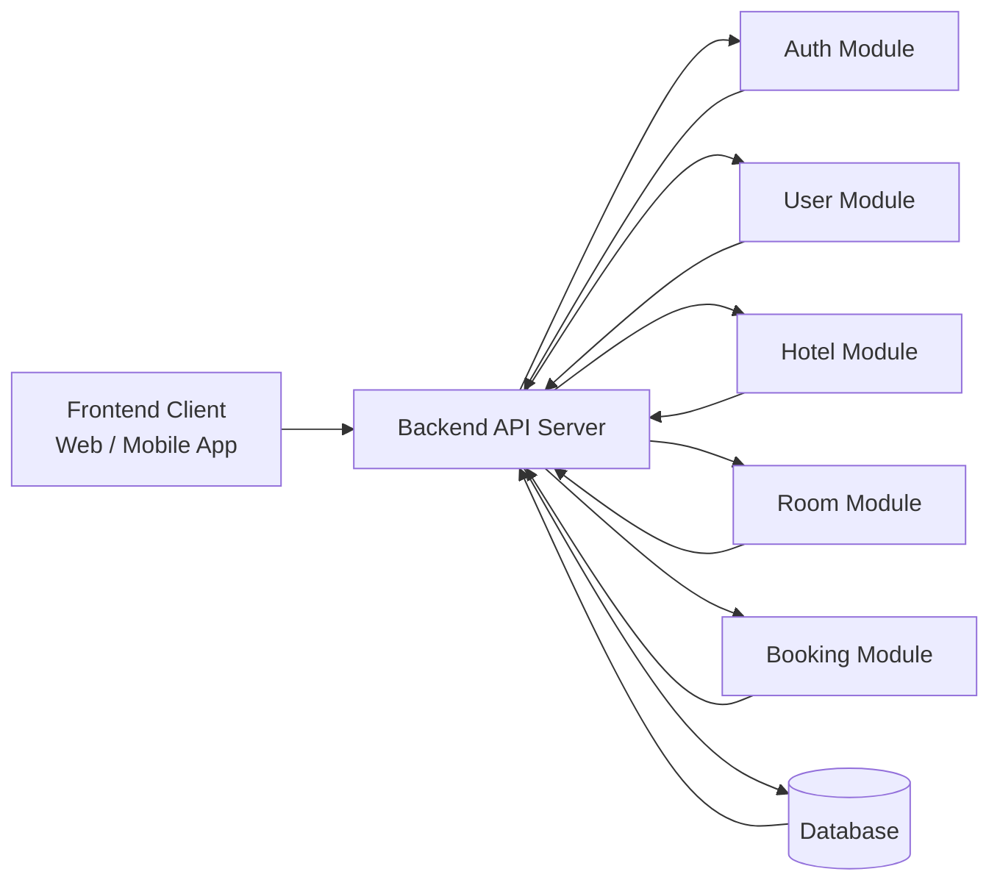

# 🌍 **Hotel Booking System**

A complete end-to-end hotel booking platform enabling users to discover hotels, browse rooms, make reservations, and manage bookings — with a full admin panel for hotel, room, and user management.

This repository contains the entire system including both the **backend API** and the **frontend client**.

## 🚀 **Project Overview**

The Hotel Booking System is designed to provide:

- A simple and seamless experience for users to search hotels, view room details, and make bookings.
- A full administrative workflow to manage hotels, rooms, and user roles.
- Secure authentication and authorization for both users and admins.
- A clean, scalable architecture suitable for real-world production usage.

This project is built with separation of concerns in mind — backend and frontend are separated into independent modules.

## 🧱 **Repository Structure**

```
/
├── server/      # REST API for authentication, hotels, rooms, bookings, admin tools
├── frontend/     # User-facing client (React / Next.js / Vite / React Native)
└── README.md     # Main project README
```

## 🏨 **Core Features**

### **🔐 Authentication**

- Secure login, register, logout
- Token-based authentication
- Role-based access control (User / Admin)

### **👤 User Features**

- Browse available hotels
- View rooms within selected hotels
- Check room details
- Create bookings
- View profile, update basic info
- Cancel existing bookings

### **🛠 Admin Features**

- Manage users and admins
- Create, update, delete hotels
- Add, modify, or delete rooms
- Monitor all bookings

### **📊 System Features**

- Paginated data retrieval
- Clean API architecture
- Validation & error-handling layer
- Modular project structure
- Scalable and extensible design

## 🏗️ **High-Level Architecture**



## 📦 **Modules in the System**

### **Server**

- Authentication Service
- User Service
- Hotel Service
- Room Service
- Booking Service
- Admin Management Service
- Global utilities (logging, validation, pagination, error-handling)

### **Frontend**

- User Interface for browsing & booking
- Authentication screens
- Hotel & room listing pages
- Booking workflow screens
- Admin dashboard (optional)

## 📄 **Documentation**

- Backend API documentation: `Server/API.md`
- It is also published on Postman which you can find by clicking [here](https://documenter.getpostman.com/view/49066397/2sB3WyLcUF)
- Backend code-level documentation inside each module
- Frontend documentation (if using React, Next.js, Vite, or React Native) will live inside `frontend/`

## 🧪 **Development Setup**

1. Clone the project
2. Install backend & frontend dependencies
3. Set up environment variables
4. Start backend server
5. Start frontend project
6. Access client in browser/device

👉 Detailed setup instructions are available in backend and frontend READMEs.

## 🚀 **Deployment**

The system can be deployed in multiple ways:

- Entire stack deployed on a single server
- Backend on cloud (e.g., AWS / Render / Railway), frontend on static hosting
- Mobile builds (if using React Native)
- Docker-based deployment

Deployment steps will vary based on your chosen frontend technology.

## 🤝 **Contributing**

Contributions are welcome!

1. Create an issue
2. Fork the repo
3. Create a feature branch
4. Commit changes
5. Open a PR

## 📄 **License**

MIT License — free to modify and use with credit.
